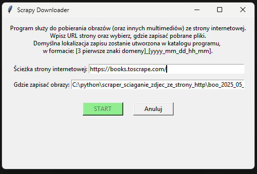

Oto poprawna wersja pliku **README.md** w formacie Markdown, którą możesz dodać do swojego repozytorium. Tym razem upewniłem się, że struktura jest klarowna, a formatowanie powinno wyświetlać się poprawnie na GitHubie.

---

```markdown
# Scraper Downloader – Pobieranie obrazów ze stron internetowych



## 📌 Opis projektu

**Scraper Downloader** to aplikacja napisana w Pythonie, która umożliwia pobieranie multimediów (głównie obrazów) ze stron internetowych.  
Program posiada **graficzny interfejs użytkownika** (GUI), umożliwiający wpisanie adresu URL, wybór katalogu zapisu i rozpoczęcie pobierania.  

Wykorzystuje:
- 🕷️ **Scrapy** – do obsługi pobierania stron i ekstrakcji danych,
- 🔗 **requests** – do pobierania plików z internetu,
- 📊 **tqdm** – do dynamicznego wyświetlania pasków postępu.

---

## 📂 Struktura projektu

```
scraper_sciaganie_zdjec_ze_strony_http/
├── images/
│   └── interfejs.png       # Zrzut ekranu interfejsu programu
├── src/
│   └── main.py             # Główny plik z kodem aplikacji
├── requirements.txt        # Lista zależności (Scrapy, requests, tqdm, itp.)
├── start.bat               # Skrypt uruchamiający środowisko wirtualne
├── README.md               # Ten plik
└── venv/                   # Środowisko wirtualne (nie wersjonowane - ujęte w .gitignore)
```

> **💡 Uwaga:** Katalog `venv` nie jest wypychany do repozytorium. Jest wykluczony w `.gitignore`, aby każdy użytkownik mógł samodzielnie utworzyć swoje środowisko i zainstalować zależności.

---

## 🖥️ Instalacja i uruchomienie (Windows)

### 1️⃣ Klonowanie repozytorium:

W terminalu lub PowerShell wykonaj:

```bash
git clone https://github.com/legionowopawel/sciaganie_zdjec_ze_strony_http_scrapper.git
```

---

### 2️⃣ Uruchomienie środowiska wirtualnego:

W katalogu głównym projektu znajduje się plik `start.bat`.  
**Po dwukrotnym kliknięciu** pliku `start.bat`, otworzy się terminal z aktywowanym środowiskiem wirtualnym.

---

### 3️⃣ Instalacja zależności:

W aktywowanym środowisku uruchom komendę:

```bash
pip install -r requirements.txt
```

---

### 4️⃣ Uruchomienie aplikacji:

Przejdź do katalogu `src` i uruchom główny skrypt:

```bash
python main.py
```
